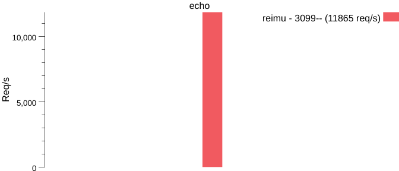

# Reium -- 高性能网络库

## 目标

* reactor + 多线程
* 高性能日志库 （30%）
* 基于切片的字符串处理
* 定时任务
* Tcp链接处理

## Get start


客户端：

```cpp  

auto loop = reimu::EventLoop::GetInstance();

auto c = std::make_shared<reimu::TcpConn>(&loop, 10);

c->OnConnected([](reimu::TcpConnPtr conn ){
    std::cout<<"链接成功"<<std::endl;
    conn->Send("hello");
});

c->OnMsg([](reimu::TcpConnPtr conn, reimu::Slice s ){

    std::cout<<"收到消息"<<s.toString()<<std::endl;
});

c->Connect("0.0.0.0", 10010);


loop->Loop();
```


服务端：

```cpp
    auto loop = reimu::EventLoop::GetInstance();

    auto s = new reimu::TcpServer(loop, "0.0.0.0", 10011);
    s->SetConnTimeout(5000);

    s->OnConnMsg([](reimu::TcpConnPtr conn, reimu::Slice s) {

        std::cout << "收到消息" << s.toString() << std::endl;
        conn->Send("hello");
    });

    s->OnConnDisconnected([](reimu::TcpConnPtr conn) {
        std::cout << "断开链接"<<std::endl;

    });
    s->OnAccept([](reimu::TcpConnPtr conn) {
        std::cout << "收到链接"<< "来自 "<<conn->GetDestAddr().ToString()<<std::endl;
    });

    s->StartServer();
    loop->Loop();
```


## Q&A

* Q1: 并发模式？
A1:


把可能比较费时间的用户逻辑放在单独的线程里处理， 
这样又能保证一个套接字（内核程度）只有一个线程在操作， 不用加锁， 性能也不错, 线程之间通过SafeQueue做同步

* Q2: 事件处理？

只处理了 POLLIN 和 POLLOUT 具体的错误根据读写操作时的erron来判断

* Q3： 字符串处理？

用Slice 作为字符串的视图， 记录起始地址， 当用户真正需要的时候再自行拷贝

* Q4: 错误处理？

erron 的 EAGAIN EMFILE EINTR ECONNABORTED 不视作错误  直接重试或等下一次

* Q5: 日志处理？

目前只是一个简单的基于SafeQueue做日志异步消费

* Q6: 超时处理？

可对每个链接设置超时时间， 调用超时的回调， 完成回调后直接关闭， 
服务器会记录超时的链接， 把超时的链接踢出去。

* Q7: 压力测试


```shell
cd benchmark
./bench-echo.sh 2>&1 | tee out/echo.txt
```




